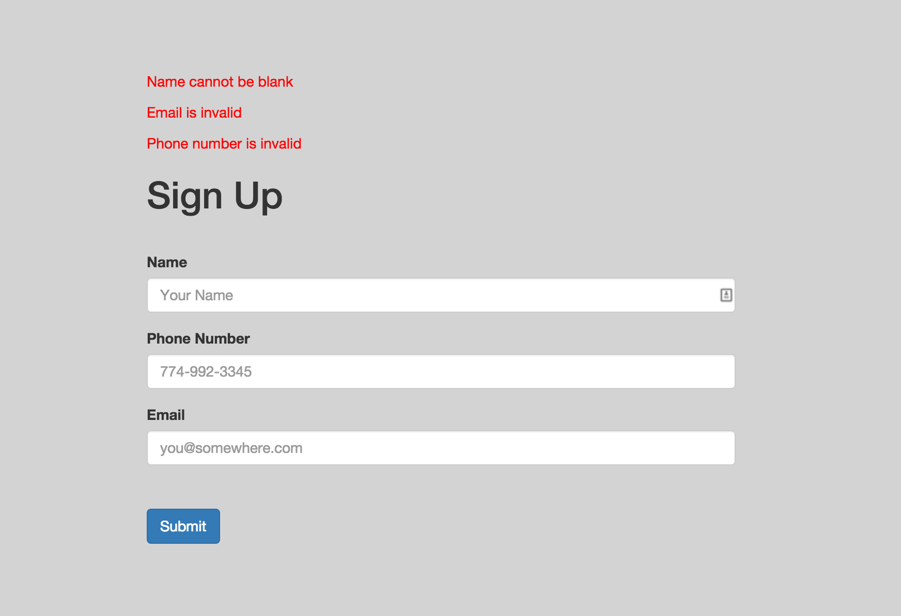

## Objectives

* Be able to check for valid user input
* Be able to extract validation functions out of routes
* Be able to display validation errors to user
* Be able to use includes to display errors
* Be able to display existing user input on re-render
* Be able to execute Test Driven Development

## Set Up

__if you haven't previously used mocha__
```ssh
npm install -g mocha
```

```ssh
 npm install
 nodemon
```

## Overview

Your mission is to be able to validate user input in your Express routes.

Use the provided tests to unit test your validation functions. When all tests are passing, incorporate the functions into your route to validate user input and return errors when necessary.

When user input is invalid, the form should be re-rendered and the user should see the appropriate error messages. User information that was entered the first time should still be present upon re-rendering.

* Write your validation functions in `lib/validations.js` and export them.
* require your validations module in `routes/index.js`

__Your routes should:__

* _call_ validation functions only, rather than _writing_ your functions in the routes
* Import validation functions from a `lib/validations.js` file
* re-render the page when user input is invalid
* upon re-rendering send a locals object to the view to pre-fill any previously entered input fields
* send an array of errors to the view if re-rendering
* res.send("You are so valid") when user input is valid

## STORIES

### Step One

Using the tests in `test/test_user_input_validations`, test drive your validation functions by writing code to pass one test at a time. Then, call those functions in your routes to validate user input and return an errors array when errors are present.

__# 1__

```
When a user submits the form
And the name input is blank
Then they see a red error message "Name cannot be blank"
```

__# 2__

```
When a user submits the form
And the phone number input is blank
Then they see a red error message "Phone number is invalid"
```

__# 3__

```
When a user submits the form
And the email input is blank
Then they see a red error message "Email is invalid"
```

__# 4__

```
When a user submits the form
And the user leaves multiple inputs blank
Then they should see multiple error messages
```



### Step Two

__Display your error messages using an errors partial (also know as an include)__

1. Add a directory to `views` called `includes`
2. Add a file in `includes` called `errors.jade`
3. Extract your error messages out of your `index.jade` and put them in `includes/errors.jade`
5. In `index.jade` add an `if` statement that checks for the presence of errors and renders your `errors` partial to display errors when errors are present.

### Stretch

Using the tests in `test/test_stretch_user_input_validations`, test drive your validations to check for more than just empty input.

## How to Submit

When all tests are passing:

* Deploy to Heroku
* Add Heroku URL to top of this README
* Submit pull request
