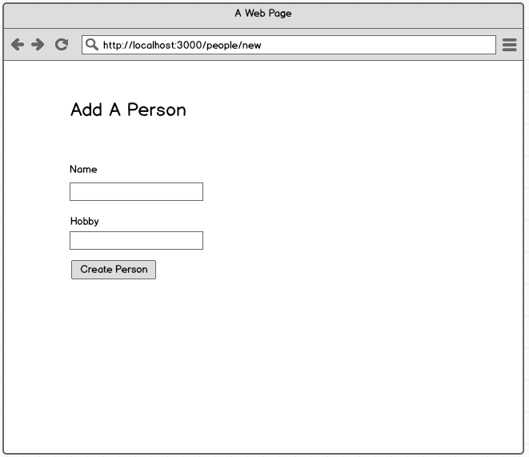
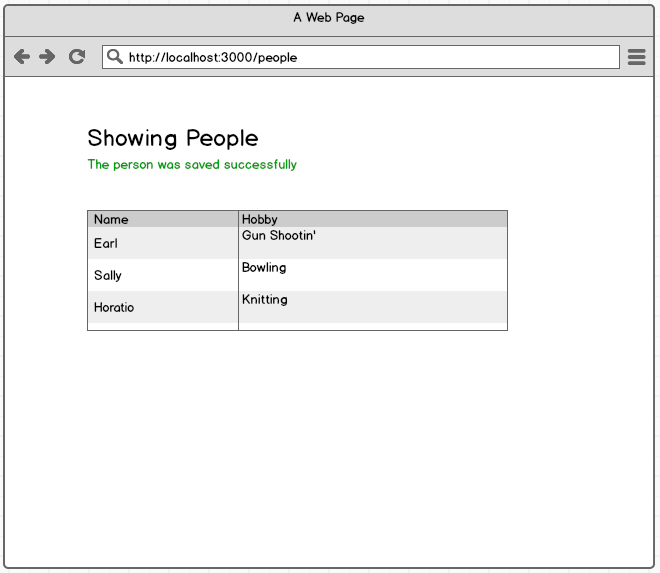
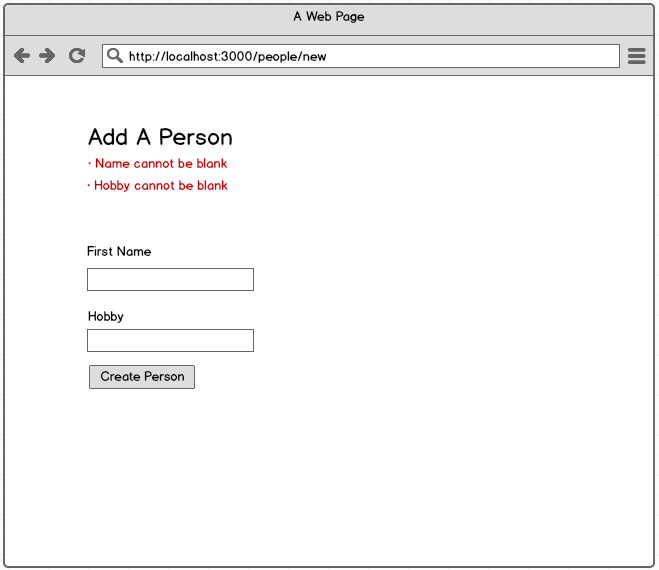

## Set Up

- Read through this document to get familiar with the concepts
- Generate a new express app
  - remember the `--git` flag
  - choose a template engine that you are comfortable with
- Complete all of the stories below

## Stories

### Users can create people

```
When a user goes to the site's homepage
And clicks "Add a Person"
And fills out the form
And clicks "Create Person"
Then they should see the created person on the people index page
And a success message should appear
```



### Errors are displayed when a form is not filled out correctly

```
When a user fills out a form
And clicks "Submit"
When any of the form fields are blank (or invalid)
Then the 'new' template should be re-rendered and error messages should appear
```


### Person names must be unique

```
When a user fills in the name field with a name that already exists in the database
And clicks "Submit"
Then the 'new' template should be re-rendered and error messages should appear that read "Name is already taken"
```

BONUS:  implement this story using unique constraints and error-handling.  How would you add the unique index to the table?   Directly in the console?  If so, how would you get that change onto other developer's machines, and into production?


### Extract an error partial

Now that you have error messages, create an errors partial, and include it in your form.

- http://jade-lang.com/reference/includes/
- https://github.com/barc/express-hbs
- https://scotch.io/tutorials/use-ejs-to-template-your-node-application
