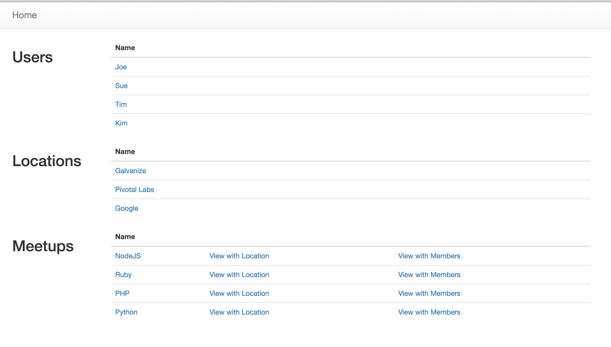
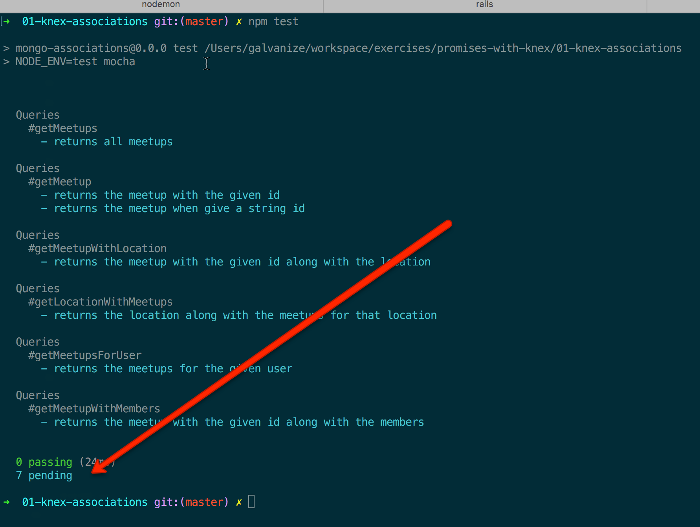

# Knex Associations w/ Promises

## Objectives

By the end of this challenge you should be able to:

- Get data from multiple tables in succession, without using joins
- Use a variety of knex methods including `where`, `whereIn` and `pluck`

## Overview

In this challenge you will:

- Write functions that return promises
- Call the functions you've written to send data to a view

## Setup the app

First, `cd` into this directory, then run:

```
createdb knex-associations-development
npm install
npm run migrate
npm run seed
nodemon
```

You should see a homepage that looks like this:



## Setup Tests

```
createdb knex-associations-test
npm run test:prepare
```

Then run tests with:

```
npm test
```

You should see that there are 0 passing, and several pending tests:



## Activity Overview

**Draw a data model**

After you've run `npm run seed`, run `npm run db` and look at the tables:

- Use `\dt` to list all tables
- Use `\d meetups` to inspect the meetups table
- On a whiteboard, draw out the data model from this information

Keep this data model around - you can refer to it as you go through the other exercises.

Once you are done, check your answer against [this image](wireframes/erd.png).

**Grok the architecture**

- You will write all of your database code in separate modules in `lib`
- Each module in lib is a function that returns a promise
- Each challenge consists of two parts:
  - Making the tests pass by writing the function
  - Using that function to make the app work

**Checkout the passing test / module**

- Open `test/01.get-meetups.test.js`
- Change `xit` to `it`
- Run the tests with `npm test`

This test is already passing.  Go to `lib/01.get-meetups.js` to see the code that makes it pass.

Once you think you know what's happening, move on to the activities below.

## Activities

- Go to `test/02.get-meetup.test.js`
- Change the `xit` to `it`
- Run the tests
- Go to `lib/02.get-meetup.js` and read the instructions
- Implement the function and make the tests pass
- Go to `routes/index.js` and find the route that corresponds to `02.meetup`
- Call your newly created function, and test your code by looking in the browser

Rinse and repeat for each of the challenges until

1. there are 0 pending tests
1. all links from the homepage of the app work and display the data you would expect them to display
